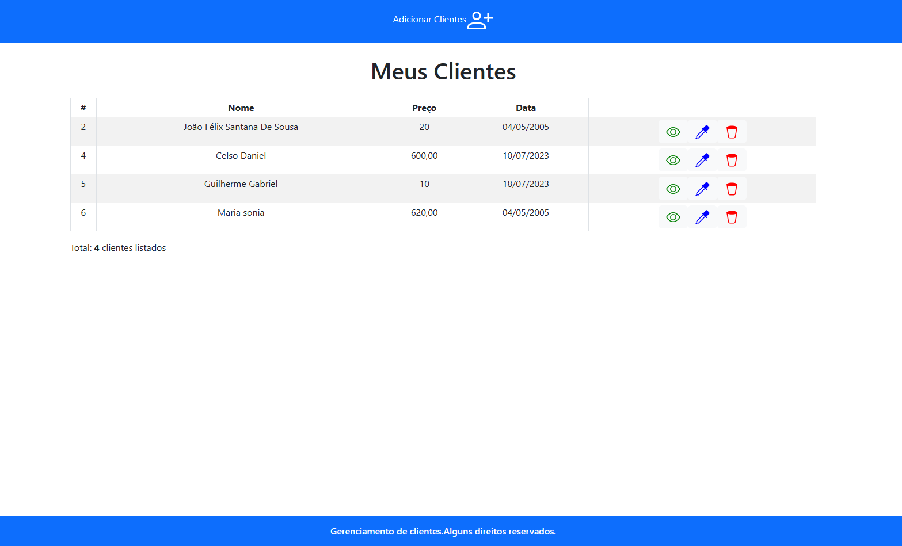
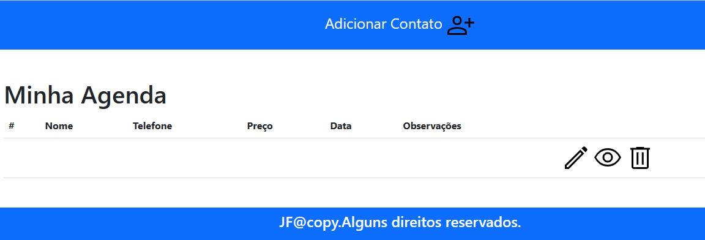
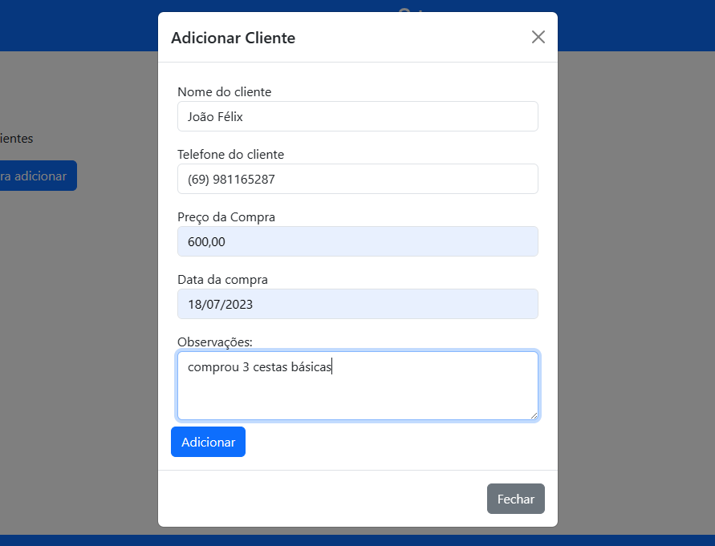
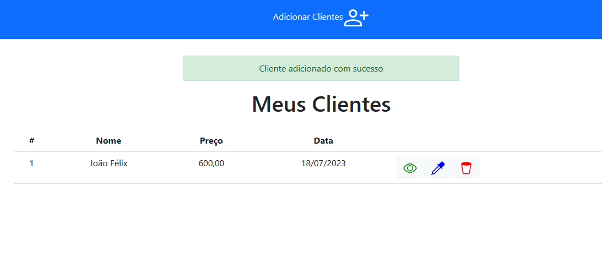
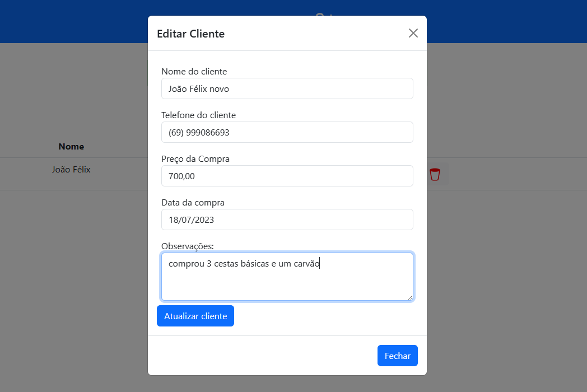
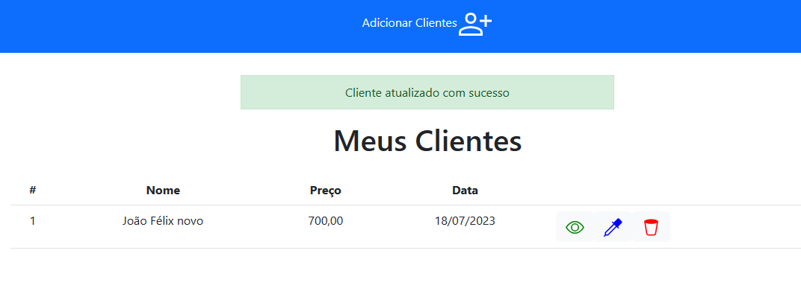
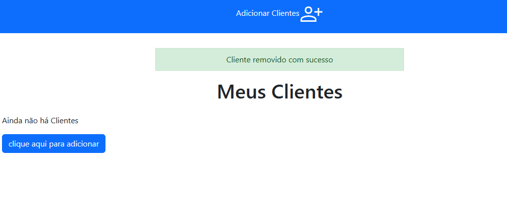

# Sobre o projeto

🚀✨ Gerenciador de Clientes em PHP ✨🚀

👋 Olá, pessoal! Hoje estou animado para compartilhar um projeto super legal que desenvolvi: um Gerenciador de Clientes em PHP! 🤩

💼 Neste projeto, criei uma aplicação web que permite o gerenciamento de uma lista de clientes. Através dela, você pode visualizar, editar, adicionar e até mesmo excluir clientes. É perfeito para organizar informações importantes sobre seus clientes de forma prática e eficiente.

📊 Na interface, utilizei HTML, CSS e a poderosa biblioteca Bootstrap para deixar tudo com uma aparência bonita e responsiva, garantindo uma experiência agradável para o usuário.

🗄️ Os dados dos clientes são armazenados em um banco de dados MySQL, garantindo que as informações sejam persistentes e seguras.

🔍 Na visualização da lista de clientes, você encontrará uma tabela com detalhes como nome, preço, data e botões intuitivos para realizar ações específicas.

👀 Para dar um toque especial, adicionei modais que abrem ao clicar nos botões de visualizar, editar e excluir, proporcionando uma interação fluida e amigável.

📝 Ainda mais interessante é que a aplicação utiliza conceitos de auto incremento no banco de dados, garantindo que o ID dos clientes seja gerado automaticamente e único, evitando conflitos e garantindo a integridade dos dados.

💡 Esse projeto é uma excelente oportunidade para aprender os conceitos fundamentais de desenvolvimento web com PHP e MySQL, além de praticar habilidades em CRUD.

🎉 Espero que vocês gostem desse projeto tanto quanto eu gostei de desenvolvê-lo. Sintam-se à vontade para explorar, sugerir melhorias e até mesmo utilizá-lo em seus próprios projetos.

  
  
  
  
  
  
  
  

# Tecnologias utilizadas

# Autor

João Félix Santana de Sousa

https://www.linkedin.com/in/joaofelixss
